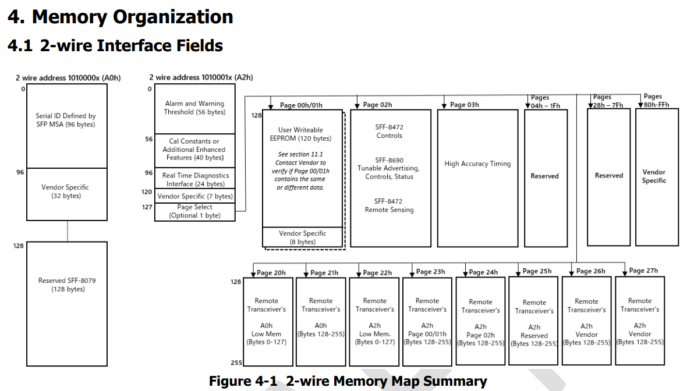
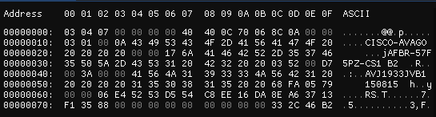

# Описание
Коммутатор Cisco MDS9000 series (например MDS 9148S 16G 48 FC) не поддерживает модули SFP+ сторонних
производителей и не позволяет изменить это в программном режиме, как например ethernet коммутаторы
с опцией 'service unsupported-transceiver'. Для работы сторонних модулей SFP+ необходимо менять
прошивку на модулях. Из чего она состоит, как ее генерировать и как прошивать расскажу далее.

# Структура памяти модулей SFP/SFP+
В спецификации MSA SFF-8472 [DRAFT SFF-8472 NCB.pdf](docs/DRAFT%20SFF-8472%20NCB.pdf)
можно найти всю информацию о структуре памяти. Если не вдаваться в детали,
то структура состоит из двух страниц A0h и A2h размером по 256 байт каждая.


## Страница A0h
Состоит из двух блоков по 128 байт. В младшем блоке **0x00-0x7f** находится информация о трансивере
которая предназначеная для хранения и считывания данных о типе, поддерживаемых длинах кабеля,
производителе, серийном номере, парт-номере и т.д.
Влияние на физические свойства передатчика она не оказывает и выполняет только декларативную функцию.
Эта информация находится в младших 96 байтах **0x00-0x5f**. В оставшихся 32 байтах предусмотрено хранение
специфичных для производителей данных. Замечу сразу, что Cisco использует именно этот 32-байтный блок.

Старший блок **0x80-0xff** зарезервирован MSA SFF-8472: Reserved (was assigned to SFF-8079). 
## Страница A2h
...

## Описание некоторых блоков данных страницы A0h


# Генерация прошивки
...

## Расчет контрольной суммы 8bit-mod256
Контрольных сумм в области A0h 0-127 две. Одна по смещению **0x3f** (CC_BASE), другая **0x5f** (CC_EXT).
Каждая представляет из себя сумму байт **0x00-0x3e** и **0x40-0x4e** соответственно.
Рассчитывается как остаток от деления
суммы на 256.
Пример на shell:
```shell
user@host$ echo 'obase=16;ibase=16;scale=0;(0A 43 49 53 43 F0)%100' | sed 's/ /+/g' | bc
1C
```

## Расчет Cisco vendor specific полей
...  
MD5  
CRC32 (LE)

# Программа для генерации прошивки
[sfg.go](sfg.go) - простая реализация генератора прошивки в бинарном виде страницы A0h (0-127) на Golang.  
Готовую прошивку можно прошивать в модуль без дополнительных изменений.