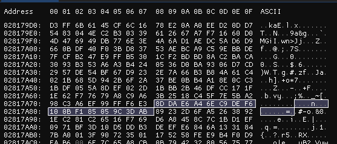
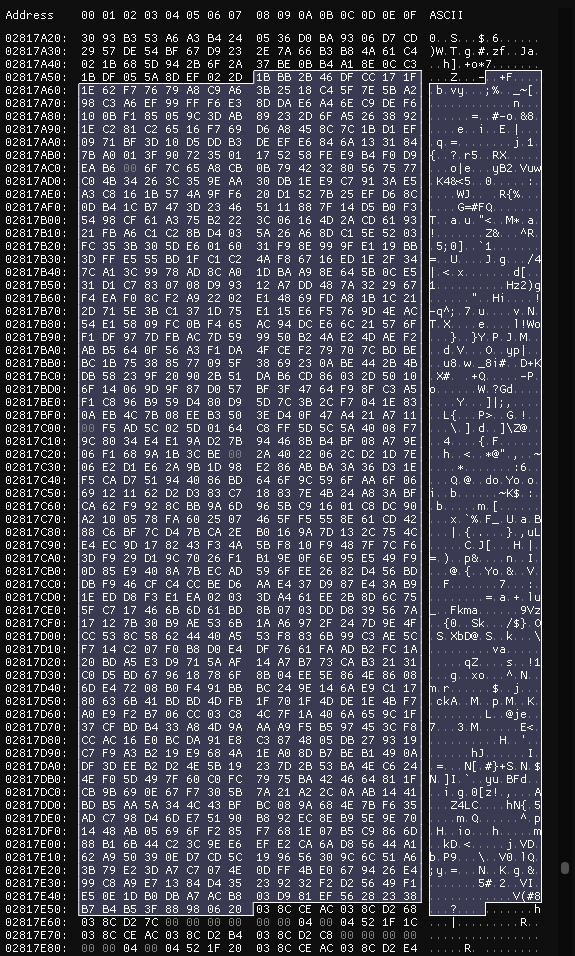

# Описание
Коммутатор Cisco MDS9000 series (например MDS 9148S 16G 48 FC) не поддерживает модули SFP+ сторонних
производителей и не позволяет изменить это в программном режиме, как например ethernet коммутаторы
с опцией 'service unsupported-transceiver'. Для работы сторонних модулей SFP+ необходимо менять
прошивку на модулях. Из чего она состоит, как ее генерировать и как прошивать расскажу далее.

# Структура памяти модулей SFP/SFP+
Производство трансиверов в большинстве подчиняется так называемым соглашениям MultiSource Agreement (MSA).
Это соглашения между крупнейшими производителями о стандарте производства и поддержки трансиверов, оптоволоконных кабелей,
сетевого оборудования и т.д.
Соглашения MultiSource Agreement (MSA) четко определяют адресное пространство для каждого типа модулей,
что позволяет производителям сетевого оборудования, добавлять в прошивку служебную информацию, проверив которую,
коммутатор сделает заключение о совместимости конкретного устройства.
Спецификация MSA SFF-8472 [DRAFT SFF-8472 NCB.pdf](docs/DRAFT%20SFF-8472%20NCB.pdf)
описывает структуру памяти трансиверов SFP и SFP+.

Структура состоит из двух страниц A0h и A2h размером по 256 байт каждая, каждый из которых разбивается еще на два 
блока по 128 байт. Прошивка может тоже быть разбита на блоки по 128 байт или по 256, в зависимости от программатора.

Диаграмма из спецификации:


## Страница A0h
В младшем блоке `0x00-0x7f` находится информация о трансивере
которая предназначеная для хранения и считывания данных о типе, поддерживаемых длинах кабеля,
производителе, серийном номере, парт-номере и т.д.
Влияние на физические свойства передатчика она не оказывает и выполняет только декларативную функцию.
Эта информация находится в младших 96 байтах `0x00-0x5f`. В оставшихся 32 байтах предусмотрено хранение
специфичных для производителей данных. Замечу сразу, что Cisco использует именно этот 32-байтный блок.

Старший блок `0x80-0xff` зарезервирован MSA SFF-8472: Reserved (was assigned to SFF-8079).

## Страница A2h
В младшем блоке `0x00-0x7f` находится информация о диагностическом интерфейсе
Digital Diagnostics Monitoring (DDMI/DOM), такие как пороговые значения тревог и предупреждений (сигнал, температура),
а также текущие значения показателей. При записи, для модулей, соответствующих стандарту MSA, может потребоваться ввод
пароля производителя. Ввод пароля длиной 4 байта осуществляется в область страницы A2h по смещению `0x7b`.

Трансиверы с функцией расширенного адресного пространства поддерживают регистр переключения страниц
(до 255 страниц) — Page Select Byte в области страницы A2h по смещению `0x7f`, который принимает значение номера
дополнительной страницы. Дополнительные страницы могут использоваться для обеспечения расширенных функций, например,
регистры управления SFP+ DWDM Tunable представлены в дополнительной странице Page 02h.

Страница A2h в старшем блоке `0x80-0xff` предусмотрена для хранения специфического кода производителя.
Данная область памяти может содержать набор данных, влияющий на совместимость с брендовым коммутационным
оборудованием. Общего стандарта, который описывает структуру данных в этой области, не существует.

## Описание некоторых блоков данных страницы A0h
Хранящиеся данные страницы A0h и их описание представлены в таблице. Цветом отмечены наиболее интересующие блоки
для изменения в прошивке: VENDOR, PART NUM, SERIAL, MNF DATE.
Для Cisco необходимо также заполнить `0x60-0x7f` [особым образом](#cisco-checksum).

Дамп модуля Cisco DS-SFP-FC16G-SW (производитель AVAGO):


<details>
<summary>Описание адресов</summary>

По порядку подсвеченные блоки отвечают за:
1. `0x14-0x23` - VENDOR - производитель модуля
2. `0x28-0x37` - PART NUM - парт номер модуля
3. `0x3f` - контрольная сумма базового блока `0x00-0x3e`
4. `0x44-0x53` - SERIAL - серийный номер модуля
5. `0x54-0x5b` - MNF DATE - дата производства, `DDMMYYYY`
6. `0x5f` - контрольная сумма блока `0x40-0x5e`
7. `0x60-0x7f` - специфичный для Cisco блок который проверяется оборудованием


</details>

# Генерация прошивки
Для генерации удобно взять дамп текущей прошивки донорского модуля и заменить некоторые интересующие данные, затем
рассчитать контрольные суммы общих данных и специфичных для Cisco. Например меняем VENDOR и SERIAL. Длина полей
должна быть строго 16 байт, пустые байты принято заполнять пробелами. Затем считаем контрольные суммы данных и 
заполняем блок специфичный для Cisco.

## Расчет контрольной суммы 8bit-mod256
Контрольных сумм в младшем блоке A0h две. Одна по смещению `0x3f` (CC_BASE), другая `0x5f` (CC_EXT).
Каждая представляет из себя сумму байт `0x00-0x3e` и `0x40-0x4e` соответственно.
Рассчитывается как остаток от деления суммы на 256.  
Пример на unix shell:
```shell
echo 'obase=16;ibase=16;scale=0;(0A 43 49 53 43 F0)%100' | sed 's/ /+/g' | bc
# 1C
```

## <a id="cisco-checksum"></a> Расчет Cisco vendor specific полей
Все данные хранятся в 32-байтном блоке по следующей схеме
```
0x60 0x0000
0x62 vendor id
0x63 MD5 checksum
0x73 0x000000000000000000
0x7c CRC32
```
Список вендоров есть в файле [cisco_vendors_dump.hex](data/cisco_vendors_dump.hex), который был сдамплен из прошивки
c3560-ipbasek9-mz.150-2.SE9.bin (SHA1 80501A593A12AE43E92AE8780CF4F3778093DB80).
Чтобы понять, что дампить, нужно распаковать прошивку и поискать в извлеченном файле известный ранее **vendor key**
произвоидителя FINISAR `8DDAE6A46EC9DEF6100BF185059C3DAB`, **vendor id** которого `0x02`, затем
сместиться назад на 32 байта и выбрать вперед на 1024 байта - это и будет список всех вендоров.


<details>
<summary>Список всех вендоров</summary>

FINISAR:



Все остальные:


</details>

Каждые 16 байт по порядку в выделенном блоке это отдельный **vendor key**, а **vendor id** это смещение с нуля в hex,
т.е первый вендор это `0x00`, второй `0x01` ... одиннадцатый это `0x0a`, и так далее.
FINISAR в нашем случае третий с кодом `0x02`. Готовый дамп в 1024 байта лежит в файле [cisco_vendors_dump.hex](data/cisco_vendors_dump.hex)

Таблица найденных вендоров:

| VENDOR | ID   | KEY                              |
|--------|------|----------------------------------|
| Finisar | 0x02 | 8DDAE6A46EC9DEF6100BF185059C3DAB |
| Avago | 0x06 | 175258FEE9B4F0D9EAB6006F7C65A8CB |
| Method | 0x0e | 4AF86716ED1E2F347CA13C9978AD8CA0 |

Других проверок вендора нет, поэтому текстом в блоке `0x14-0x23` можно написать любой текст, главное, чтобы в Cisco
checksum код и идентификатор соотвествовали заранее известным из дампа.
Исходя из этого пару **id+key** любого вендора можно использовать в любых трансиверах.

### MD5 checksum
Вычисление MD5 по схеме: `vendor id + vendor name + serial + vendor key`  
Пример на unix shell:
```shell
# example: 06 + 434953434F2D415641474F2020202020 + 41564A313933334A5642312020202020 + 175258FEE9B4F0D9EAB6006F7C65A8CB
printf '06434953434F2D415641474F202020202041564A313933334A5642312020202020175258FEE9B4F0D9EAB6006F7C65A8CB' | sed 's/ //g' | xxd -r -p | md5sum # = e45253d554c8ee16da8ea63713f13588
# e45253d554c8ee16da8ea63713f13588  -
```

### CRC32
Вычисление CRC32 в unix shell по схеме: `header + vendor id + md5sum + tail`. Затем меняем последовательность байт.  
Пример на unix shell:
```shell
# example: 0000 + 06 + e45253d554c8ee16da8ea63713f13588 + 000000000000000000
printf '000006e45253d554c8ee16da8ea63713f13588000000000000000000' | xxd -r -p | rhash --printf='%c' - | tac -rs .. ; echo # = b2462c33 -> little endian 332c46b2
# 332c46b2
```
## Программирование трансиверов
### Программатор
Для программирования (прошивки) модулей можно использовать любой программатор который позволяет работать с SFP/SFP+
трансиверами. Я использовал [SFPTotal Whistle](https://sfptotal.ru/products/sfptotal-whistle). Программатор поддерживает
операции чтения и записи в память трансивера посредством двухпроводной шины IIC, подключается по USB и определяется как
последовательный порт. Используя софт производителя выполняется чтение или запись прошивок.

### Общая информация
Трансиверы делятся на защищенные и незащещенные от записи.

#### Программирование незащищенных трансиверов
На печатной плате трансиверов без защиты от записи обычно установлена микросхема памяти EEPROM,
которая может быть перезаписана без ограничений со стороны модуля. В таких трансиверах, как правило,
доступна для чтения только страница A0h, а чтение страницы A2h возвращает ошибку. 
#### Программирование трансиверов с защитой от записи
В соответствии со спецификацией MSA SFF-8472 трансиверы с поддержкой функции DDM могут иметь защиту от записи
с использованием пароля длиной 4 байта.
Чаще всего для успешного программирования 1G и 10G трансиверов необходимо осуществить предварительный ввод пароля,
перед записью изменений в память модуля.
Такие модули работают под управлением специальной микросхемы, которая контроллирует возможность записи в отдельную 
EEPROM или содержит встроенную EEPROM память

Если прошивка не выполняется успешно без ввода пароля, скорее всего трансивер защищен от записи и необходимо ввести пароль
производителя. Найти пароли можно в сети либо попробовать запросить у производителя программатора.

В спецификации MSA SFF-8636 первичный пароль должен иметь значение `0x00001011`. Пароль также должен быть в диапазоне
`0x80000000-0xFFFFFFFF`.

Вендор пароли сложно найти в сети, но для FINISAR мне удалось найти и возможно он общий для всех модулей производителя.

Пароль для трансиверов FINISAR `9bb03dfa`

Небольшой список паролей для подбора:
```text
00001011
00000000
FFFFFFFF
80000000
63737777
10011100
```

Для поиска паролей также можно использовать метод перебора, но для этого понадобится соответствующий программатор, т.к.
используемый мной SFPTotal Whistle зашивает и проверяет очень медленно. На [форуме программатора](https://forum.reveltronics.com/viewtopic.php?f=32&t=527&sid=37231fcee7b724e937ada8bef314d376)
REVELPROG-IS можно найти информацию о том, что скорость перебора составляет около 300 паролей/сек или даже до 4000 паролей/сек
при памяти FRAM or FLASH.
### Процесс
Процесс прошивки модулей всех форм-факторов выглядит одинаково:

1. трансивер устанавливается в соответствующий порт программатора
2. программатор инициализирует установленный трансивер и считывает с него внутреннее программное обеспечение
3. выбирается файл-прошивки
4. код записывается в память модуля
5. производится проверка успешности перезаписи прошивки

Чтобы убедиться, что перепрошивка прошла успешно и исключить ошибку считывания программатора,
нужно извлечь модуль и установить его обратно. При чтении прошивки она должна совпадать с ранее записанной.
Такой способ позволяет убедиться в корректности смены кода.

### Трансиверы
Для программирования использовались FC 16G трансиверы FINISAR FTLF8529P3BCV-QL, под брендом QLogic. Записать в них A0h удалось
без проблем, но A2h старший блок шьется не полностью - первые 32 байта заблокированы, с чем это связано не удалось понять.
Для корректного определения и работы в Cisco требуется корректно ввести только блок [специфичной контрольной суммы](#cisco-checksum),
но для отображения дополнительно информации о Cisco pid и part-number можно зашить в A2h старший блок, младший хранит
DDM и не требует перепрограммирования.

Дампы модулей Cisco DS-SFP-FC16G-SW:
[A0h (0-127)](data/cisco-dump/CISCO%20AVAGO__AFBR-57F5PZ-CS1__AVJ1933JVB1__SFP%20Table%20A0h%2000-7F.bin)
и [A2h (128-255)](data/cisco-dump/CISCO%20SFP%2B%20Table%20A2h%20%5B80-FF%5D.bin)

# Программа для генерации прошивки
В заключении для более удобной генерации прошивок набросал генератор на Golang.
[sfg.go](sfg.go) - реализация генератора прошивки в бинарном виде для страницы A0h (0-127).  
Готовую прошивку можно прошивать в модуль без дополнительных изменений.